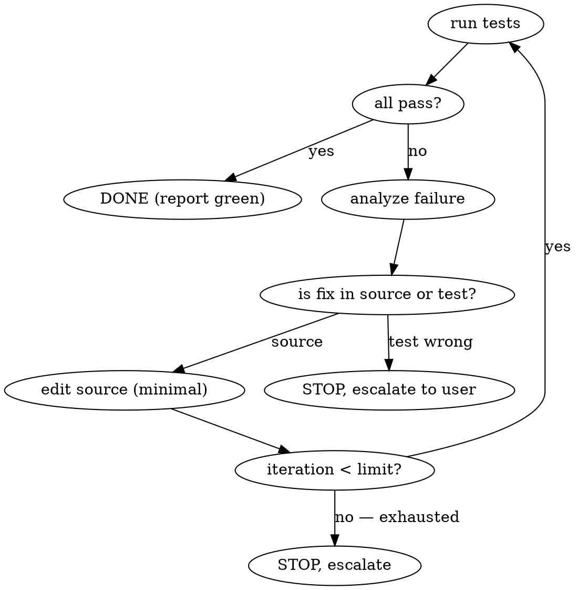

# fix-until-green

## When to use

The user is staring at a red test suite and wants you to close the loop instead of running tests manually between every edit. Triggers: "fix until green", "get tests passing", "/fix-until-green", or pasting a long test failure.

Do NOT use this skill:
- Before understanding what the user actually wants. If the failing tests are intentionally red (e.g. they're red because the user is mid-implementation of a new feature), iterating on "fix" will fight the user's intent.
- On a clean tree when the user has only asked you to write a feature. The right loop there is brainstorming → plan → TDD, not fix-until-green.

## The loop

Hard rules:

1. **Run the test command first.** Don't propose edits from imagined failures. The exact command is whatever the project uses — by default `pytest -x --no-header -q`. Honor any `FIX_TEST_CMD` env override the user mentions.
2. **Be surgical.** Each iteration: read the failing test + its error, identify the one or two lines of source code at fault, apply the smallest edit that addresses the failure. Do NOT refactor unrelated code. Do NOT add features beyond what the failure demands.
3. **Don't edit tests** unless a test is *demonstrably* wrong (asserts impossible behavior, has a bug in the fixture, etc.). If you think a test is wrong, STOP and escalate — say "test X looks incorrect because Y; want me to update the test or stick to source fixes?"
4. **Iteration cap = 5** by default. If you're on iteration 5 and still red, STOP. Tell the user what's failing, what you tried, and where you'd look next. Don't grind past the cap.
5. **Cache results between iterations.** If a test passed in iteration N and you didn't change anything in its code path, you can skip re-running it next time only if your test runner supports cached pass/fail. Otherwise re-run the full suite each iteration.
6. **Report at each iteration**: one sentence — "iter N/5: edited X to fix Y; re-running."

## Output format

After the loop completes:

- If **green**: one paragraph — what was wrong (in plain English), what you changed (file:line), iteration count. No celebration; just the diff summary.
- If **exhausted**: bulleted list — which tests still fail, what you've tried, why your last hypothesis was insufficient, what you'd investigate next. Do NOT silently exit.

## Companion non-interactive script

For unattended runs (cron, CI experiments), use `.inform/qa/scripts/fix_until_green.sh` — same behavior, no IDE session required. Env knobs documented in `.inform/qa/README.md`.

## Red flags that mean "stop the loop, ask"

- The same test fails the same way for 2+ iterations after your edits — your model of the bug is wrong; stop and re-investigate.
- Tests in unrelated files start failing after your fix — your edit had unintended scope; revert and narrow.
- The fix would require changing test fixtures or seed data — escalate.
- The fix would require adding a new dependency or library — escalate.
